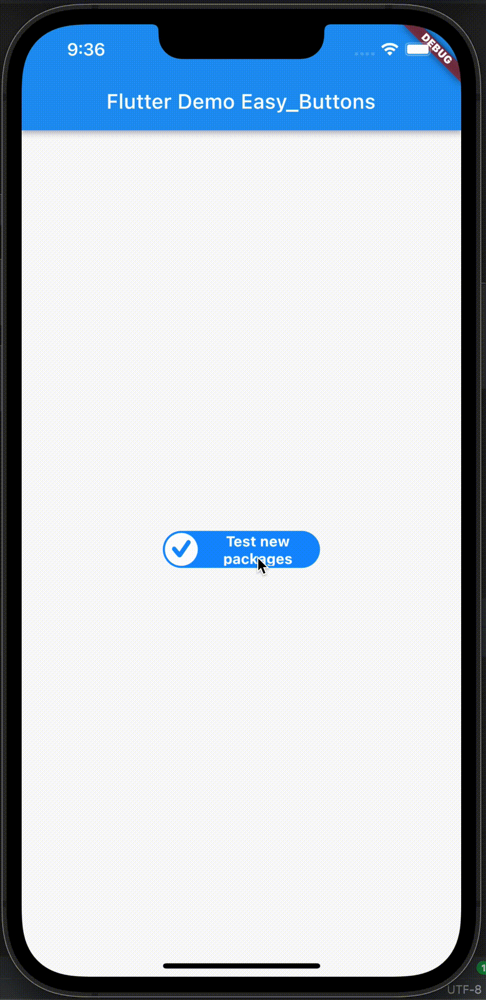

# easy_buttons

## Getting started

ClassFunc first package library



## Usage

- Install

```bash
flutter pub add easy_buttons

dependencies:
  easy_buttons: ^1.0.6
  
```

- Use package

```bash
import 'package:easy_buttons/easy_buttons.dart';


EasyButton(
          title: 'Test new packages',
          svgPicture: SvgPicture.asset('assets/images/ic_done_bottom.svg', width: 30, height: 32),
          onTap: () => showDialog<String>(
            context: context,
            builder: (BuildContext context) => AlertDialog(
              title: const Text('AlertDialog Title'),
              content: const Text('AlertDialog description'),
              actions: <Widget>[
                TextButton(
                  onPressed: () => Navigator.pop(context, 'Cancel'),
                  child: const Text('Cancel'),
                ),
                TextButton(
                  onPressed: () => Navigator.pop(context, 'OK'),
                  child: const Text('OK'),
                ),
              ],
            ),
          ),
        ),
```

## Additional information

```json
ClassFunc button package for flutter ^.^
```